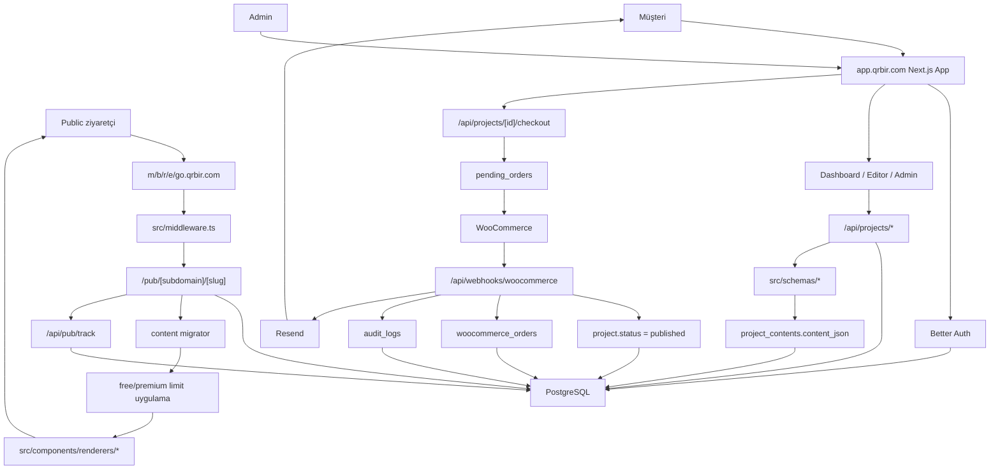
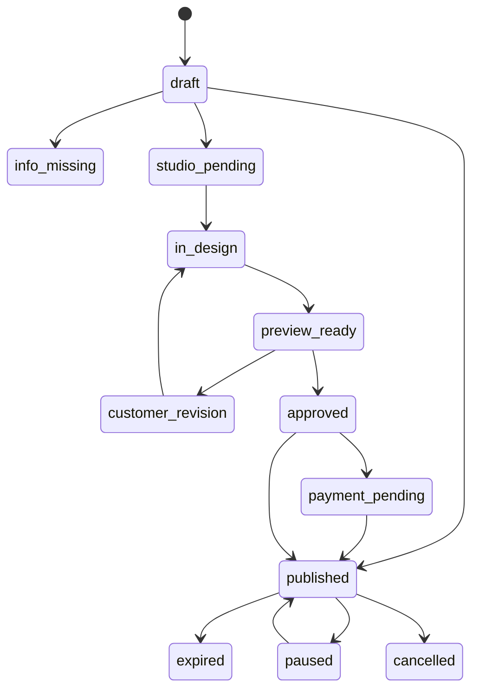
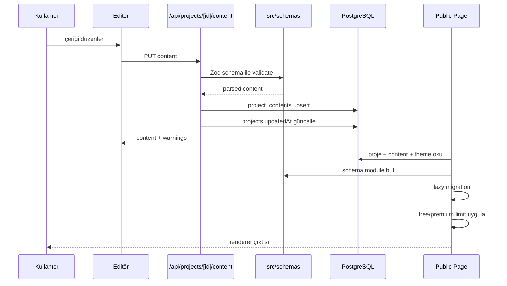
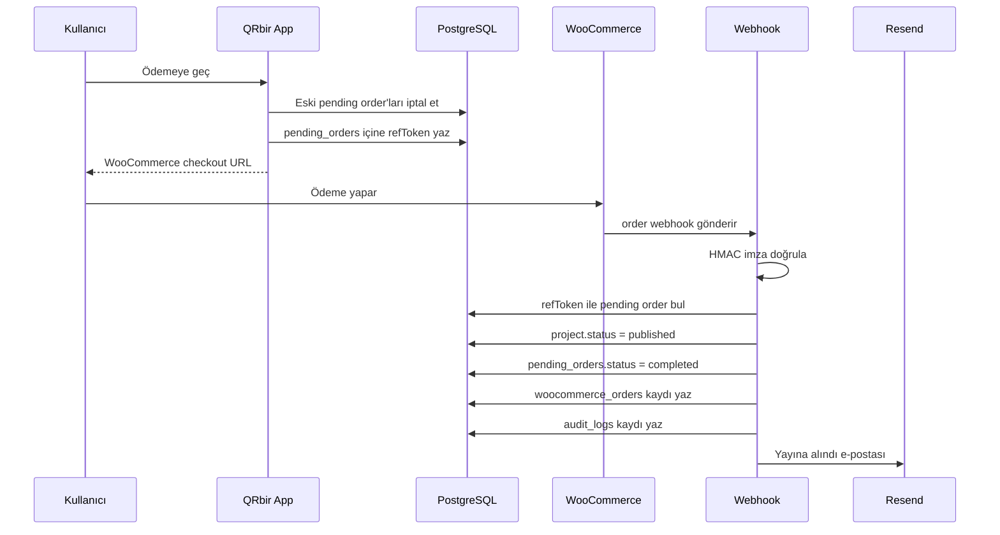
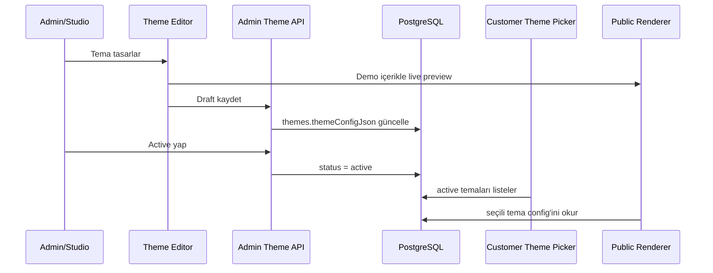

# QRbir Uygulama Mimarisi

Bu doküman `app_qrbir_com` kod tabanının mevcut mimarisini özetler. Amaç, yeni geliştirme planları yapılırken sistem sınırlarını, ana akışları ve riskli karar noktalarını tek yerde görünür kılmaktır.

## Özet

QRbir uygulaması, kullanıcıların farklı QR odaklı mikro sayfalar oluşturduğu, düzenlediği, yayınladığı ve ödeme sonrası public subdomain'lerde servis ettiği bir Next.js uygulamasıdır.

Desteklenen proje tipleri:

- `restaurant_menu`
- `bio_link`
- `brand_bio`
- `google_review`
- `event_invitation`
- `campaign_link`

Public URL yapısı proje tipine göre subdomain'e ayrılır:

- `m.qrbir.com/{slug}` -> restoran menüsü
- `b.qrbir.com/{slug}` -> bio link / marka bio
- `r.qrbir.com/{slug}` -> Google yorum
- `e.qrbir.com/{slug}` -> etkinlik daveti
- `go.qrbir.com/{slug}` -> kampanya linki

## Teknoloji Yığını

- Framework: Next.js 15 App Router
- UI: React 19, TypeScript, Tailwind CSS 4 global stilleri, `lucide-react`
- Auth: Better Auth, Drizzle adapter
- Veritabanı: PostgreSQL
- ORM / migration: Drizzle ORM, Drizzle Kit
- Ödeme: WooCommerce yönlendirme + webhook
- E-posta: Resend
- QR üretimi: `qrcode`
- Image processing / upload desteği: `sharp`, local `public/uploads`

Ana komutlar:

```bash
npm run dev
npm run build
npm run start
npm run lint
npm run db:generate
npm run db:migrate
npm run db:studio
```

## Sistem Diyagramı



## Üst Seviye Dizinler

```text
src/app
  Next.js App Router sayfaları, route handler'lar ve route group'ları.

src/app/(auth)
  Login ve register ekranları.

src/app/(app)
  Oturum gerektiren müşteri paneli, dashboard, proje editörü, tema seçimi, hesap ve admin ekranları.

src/app/pub/[subdomain]/[slug]
  Public proje renderer giriş noktası.

src/app/api
  Auth, proje CRUD, içerik, tema, upload, QR, ödeme, webhook, approval, admin ve cron API'leri.

src/db/schema
  Drizzle tablo şemaları.

src/schemas
  Proje tipi bazlı Zod içerik şemaları, default içerikler ve migration fonksiyonları.

src/components/renderers
  Public sayfalarda kullanılan ürün tipi renderer'ları.

src/lib
  Auth, DB bağlantısı, ödeme adapter'ı, mailer, slug, audit, plan limit ve content migration yardımcıları.
```

## Runtime Sınırları

Uygulamada iki ana yüzey vardır:

1. Yönetim uygulaması: `app.qrbir.com`
   - Kullanıcı login/register
   - Dashboard
   - Proje oluşturma
   - Tema seçimi
   - İçerik düzenleme
   - QR/sticker paneli
   - Ödeme başlatma
   - Admin paneli

2. Public yayın yüzeyi: `m.qrbir.com`, `b.qrbir.com`, `r.qrbir.com`, `e.qrbir.com`, `go.qrbir.com`
   - Middleware host'u okur.
   - İsteği dahili `/pub/[subdomain]/[slug]` route'una rewrite eder.
   - Proje yayında değilse status gate gösterilir.
   - Yayındaysa içerik migrate edilir, free limit uygulanır ve ilgili renderer çağrılır.

## Veri Modeli

Ana tablolar:

- `users`: Better Auth kullanıcıları ve QRbir'e özel `role`, `phone`, `wordpressCustomerId` alanları.
- `sessions`, `accounts`, `verifications`: Better Auth persistence tabloları.
- `projects`: Projenin sahibi, tipi, slug'ı, subdomain'i, status'u, tema ve plan bilgisi.
- `project_contents`: Proje içerik JSON'u ve schema version bilgisi.
- `themes`: Proje tipi bazlı tema konfigürasyonu.
- `studio_orders`: Stüdyo hizmet talebi ve durum bilgisi.
- `approval_requests`: Müşteri onay/revizyon linkleri.
- `pending_orders`: WooCommerce'e gitmeden önce oluşturulan geçici ödeme referansları.
- `woocommerce_orders`: Webhook ile gelen tamamlanmış WooCommerce siparişleri.
- `audit_logs`: Admin ve sistem aksiyonları.

Önemli veri kararları:

- Public URL benzersizliği `projects.subdomainType + projects.slug` unique constraint ile korunur.
- İçerik tipi sabit kolonlarla değil, `project_contents.contentJson` içinde JSON olarak tutulur.
- JSON içerik doğrulaması `src/schemas/*` altındaki Zod şemalarıyla yapılır.
- İçerik versiyonlama `schemaVersion` ve lazy migration üzerinden yürür.

## Proje Yaşam Döngüsü



Not: Enum bu durumları destekliyor; geçiş kuralları bugün tek bir merkezi state machine dosyasında toplanmış değildir. Kullanıcı API'leri, admin API'leri, approval akışı ve WooCommerce webhook farklı yerlerde status güncelleyebilir.

## İçerik Akışı



## Public Yayın Akışı

1. Ziyaretçi `m.qrbir.com/cafe` gibi bir URL açar.
2. `src/middleware.ts` host'u `m` subdomain tipine çevirir.
3. İstek dahili olarak `/pub/m/cafe` route'una rewrite edilir.
4. Public page `projects`, `project_contents` ve `themes` tablolarını join ile okur.
5. Proje bulunamazsa `notFound()` çalışır.
6. Status `published` değilse durum ekranı gösterilir ve SEO için `noindex,nofollow` metadata üretilir.
7. `campaign_link` ise hedef URL'ye server-side redirect yapılır.
8. Diğer tiplerde içerik migrate edilir, free plan limitleri uygulanır ve renderer seçilir.
9. `ViewTracker` fire-and-forget olarak `/api/pub/track` çağırır.

## Ödeme ve Yayınlama Akışı



Webhook idempotency için `woocommerceOrderId` unique tutulur. `ref_token` yoksa webhook siparişi kayıt altına alınır, fakat proje aktivasyonu yapılmaz.

## Auth ve Yetkilendirme

- Auth provider: Better Auth.
- Session kontrolü server component ve route handler içinde `auth.api.getSession` ile yapılır.
- App route group'u oturum yoksa `/login` route'una yönlendirir.
- Kullanıcı şemasında `role` alanı vardır: `customer | admin | studio` niyeti görülür.
- Admin ekranları ve admin API'lerinde pratik kontrol `ADMIN_EMAILS` environment değişkeniyle yapılır.

Mimari not: `role` alanı ve `ADMIN_EMAILS` aynı anda var. Uzun vadede tek yetkilendirme kaynağı seçilmelidir.

## Tema, Tasarım ve Renderer Modeli

Mevcut durum (2026-05-12):

- QR1'den taşınan blok editör çekirdeği `src/features/block-editor` altındadır.
- Müşteri proje editörü `/projects/[id]/edit` route'unda çalışır ve içerik kaynağı `project_contents.contentJson` alanıdır.
- Proje editörü kaydı `PATCH /api/projects/[id]/content` üzerinden yapılır.
- Admin tema editörü `/admin/themes/[themeId]/edit` route'unda aynı blok editör shell'ini kullanır.
- Admin tema editörü bugün `themes.themeConfigJson.editorContent` alanına yazar.
- Admin tema preview route'u `/admin/themes/[themeId]/preview`, `editorContent` varsa `BlockContentRenderer` ile render eder.
- Müşteri tema seçimi `/projects/[id]/theme` üzerinden `projects.themeId` alanını günceller.
- Public yayın yüzeyi `/pub/[subdomain]/[slug]`, blok editör içeriğini `BlockContentRenderer` ile render edebilir.

Bu bağlantılar geçiş durumunu tarif eder. `themes.themeConfigJson.editorContent` final veri modeli değildir; QR1'deki admin yönetimli `Bloklar / Şablonlar / Tasarımlar` ayrımı taşındığında bu alan sadece backward compatibility veya migration kaynağı olarak kalmalıdır.

Nihai ayrım:

- `Bloklar`: Editörde kullanılabilen blok tiplerinin admin metadata kaydı.
- `Şablonlar`: Yeniden kullanılabilir blok kompozisyonu, örnek içerik ve site/product type contract'ı.
- `Tasarımlar`: Renk, tipografi, radius, stil ve tema token'ları gibi görsel kimlik konfigürasyonu.
- `Projeler`: Müşteriye ait canlı içerik instance'ı ve seçili şablon/tasarım referansları.

## Editör Mimarisi: Sticker ve Tema

Bu uygulamada iki ayrı editör yüzeyi planlanmalıdır. İkisi aynı "tasarım" başlığı altında görünse de veri modelleri, kullanıcıları ve çıktı formatları farklıdır.

1. QR sticker tasarım editörü
   - Kullanıcı: müşteri ve admin.
   - Amaç: belirli bir projenin public URL/QR bilgisinden baskıya uygun sticker/stand tasarımı üretmek.
   - Çıktı: sticker design JSON, SVG/PNG export, gerekiyorsa WooCommerce fiziksel ürün siparişine bağlanan varyant bilgisi.
   - Kaynak: `/Users/umitkarakas/Yandex.Disk.localized/Develop/qr-sticker` reposundaki QR rendering, shape, frame ve export core modülleri.

2. Tema tasarım editörü
   - Kullanıcı: sadece admin/studio.
   - Amaç: müşterinin tema seçim ekranında göreceği public page temalarını üretmek.
   - Çıktı: `themes.themeConfigJson`, preview image, status ve product type eşleşmesi.
   - Müşteri bu editörü kullanmaz; müşteri sadece yayınlanmış tema kartlarından seçim yapar.

Bu iki editör aynı route veya aynı tablo üzerine sıkıştırılmamalıdır. Sticker tasarımı proje/QR merkezlidir; tema tasarımı ürün tipi/renderer merkezlidir.

### QR Sticker Editörü

Mevcut `StickerPanel` yalnızca sabit şablon önizlemesi ve WooCommerce sipariş yönlendirmesi yapar. Gerçek sticker editörü ayrı bir admin/customer workspace olarak eklenmelidir.

Önerilen route yapısı:

```text
/projects/[id]/stickers
  Müşterinin proje bazlı sticker tasarımlarını gördüğü liste.

/projects/[id]/stickers/new
  Projeye bağlı yeni sticker tasarımı.

/projects/[id]/stickers/[stickerId]/edit
  Var olan sticker tasarımını düzenleme.

/admin/stickers
  Global sticker preset/template yönetimi.
```

Mevcut geçiş modül yapısı:

```text
src/lib/sticker-core
  qr-sticker reposundan taşınan saf QR, shape, frame, composition ve export mantığı.

src/components/sticker-editor
  Canvas/preview, toolbar, inspector panelleri, preset seçici ve export butonları.

src/app/(app)/projects/[id]/stickers
  Proje bazlı sticker ekranları.

src/app/api/projects/[id]/stickers
  Sticker CRUD API'leri.

src/db/schema/stickers.ts
  Sticker tasarım ve preset tabloları.
```

`qr-sticker` reposundan doğrudan taşınabilecek parçalar:

- `src/lib/core/qr-engine.ts`
- `src/lib/core/composition.ts`
- `src/lib/core/frame-composition.ts`
- `src/lib/core/export.ts`
- `src/lib/core/schemas.ts`
- `src/lib/shapes/*`
- `src/lib/frames/*`
- `src/components/StickerPreview.tsx` davranışı
- `src/context/DesignerContext.tsx` reducer fikri

Taşınmaması gereken parçalar:

- NextAuth/Prisma bağımlı auth ve DB katmanı.
- Ayrı dashboard modeli.
- Ayrı routing yapısı.
- Eski QR content catalog akışı.

Bu repo Better Auth + Drizzle kullandığı için sticker editörünün persistence katmanı mevcut app mimarisine göre yeniden yazılmalıdır.

Önerilen sticker tabloları:

```text
sticker_designs
  id
  project_id
  user_id
  name
  design_json
  preview_image_url
  export_svg_url
  status: draft | ready | ordered | archived
  created_at
  updated_at

sticker_presets
  id
  name
  product_type
  design_json
  preview_image_url
  status: draft | active | archived
  created_at
  updated_at
```

Sticker design JSON ilk sürümde şu çekirdeği taşımalıdır:

```text
content/source
  projectId
  publicUrl
  qrMode: direct | qr

qrStyle
  dotType
  dotColor
  cornerSquareType
  cornerSquareColor
  cornerDotType
  cornerDotColor
  backgroundColor
  errorCorrection
  optional logo

layout
  shapeId
  frameId
  backgroundColor
  borderColor
  borderWidth
  cta
  ctaBandColor
  decorativeColor

output
  size
  bleed
  safeArea
  productSku / wcProductId
```

QR sticker editörü için temel karar: QR verisi serbest URL olarak değil, varsayılan olarak projenin canonical public URL'i olarak üretilmelidir. Böylece müşteri slug değiştirse bile tasarım proje ile ilişkili kalır ve yeniden export edilebilir.

### Tema Tasarım Editörü

Tema editörü müşteriye açık olmayacak bir internal design tool olmalıdır. Buradaki amaç serbest web sayfası yaptırmak değil, QR1 mimarisindeki admin yönetimli blok, şablon ve tasarım kaynaklarını üretmektir.

### QR1 Tasarım Yönetimi Hedef Mimarisi

QR1 reposunda admin panelden yönetilen üç ayrı domain vardır. Bu ayrım QRbir'de korunmalıdır; proje bazlı özelleştirme daha sonra bu mimarinin üstüne eklenir.

| Domain | QR1 tablo | QR1 admin route | Sorumluluk | QRbir hedefi |
| --- | --- | --- | --- | --- |
| Bloklar | `block_types` | `/admin/blocks` | Editörde seçilebilen blokların adı, kategori, ikon, pro durumu, izinli site tipleri ve aktiflik bilgisi | `src/features/block-editor` içindeki `AddBlockSheet` lokal registry yerine admin kayıtlarını da okuyabilmeli |
| Şablonlar | `templates` | `/admin/templates`, `/admin/templates/:id/edit` | Yeniden kullanılabilir blok kompozisyonu, site/product type, demo ayarları ve bağlı tasarım | Yeni admin template editörü blokları `templates.blocks/settings/theme_id` alanlarına kaydetmeli |
| Tasarımlar | `themes` | `/admin/themes` | Renk, font, radius, stil ve preview konfigürasyonu | Mevcut `themes` tablosu görsel tasarım token'ı kaynağı olarak netleştirilmeli veya marketplace tema kaydıyla çakışıyorsa ayrı `designs` tablosuna ayrılmalı |

Bu hedefte veri sahipliği şu şekilde olmalıdır:

- Blok registry `block_types` tablosundan gelir; component implementation yine kodda kalır.
- Şablon editörü blok dizilimini ve template-level ayarları kaydeder; müşteri proje içeriğini değiştirmez.
- Tasarım editörü görsel token üretir; blok kompozisyonu taşımaz.
- Proje editörü müşteri içeriğini ve seçili template/design referanslarını kullanır.
- Public renderer proje içeriğini render ederken seçili şablon ve tasarım token'larını okur.

Mevcut `/admin/themes/[themeId]/edit` route'u QR1 blok editörüyle çalışır, fakat bugün şablon içeriğini `themes.themeConfigJson.editorContent` içine yazdığı için geçiş katmanıdır. QR1 yapısı taşındığında template editörü ayrı `/admin/templates/[templateId]/edit` route'una alınmalı; `themes` veya yeni `designs` kayıtları sadece tasarım token'larını saklamalıdır.

Editör servis katmanı QR1'deki yaklaşıma yaklaştırılmalıdır:

- `project/live` mode: `project_contents.contentJson` okur ve yazar.
- `template` mode: `templates.blocks/settings/theme_id` okur ve yazar.
- `guest` mode: persistence olmadan demo veya onboarding kullanır.
- Ortak `EditorProvider` block CRUD, selection, undo/redo, theme selection ve save contract'ını sağlar.

QR1'den başlangıçta taşınacak ana dosyalar:

- `src/pages/admin/AdminBlocks.tsx`
- `src/pages/admin/AdminTemplates.tsx`
- `src/pages/admin/AdminThemes.tsx`
- `src/pages/admin/TemplateEditor.tsx`
- `src/components/admin/ThemeModal.tsx`
- `src/services/TemplateEditorService.ts`
- `supabase/migrations/*block_types*`, `*templates*`, `*themes*`

Taşıma sırasında Supabase erişimleri Better Auth + Drizzle + route handler modeline çevrilmelidir.

### Geçişteki Admin Tema Route'u

Önerilen route yapısı:

```text
/admin/themes
  Tema listesi, filtre, durum yönetimi.

/admin/themes/new
  Yeni tema.

/admin/themes/[themeId]/edit
  Tema tasarım editörü.

/admin/themes/[themeId]/preview
  Ürün tipi ve demo içeriklerle public renderer preview.
```

Önerilen modül yapısı:

```text
src/features/block-editor
  QR1'den taşınan ortak blok editör shell'i, canvas, sheet ve context katmanı.

src/lib/theme-editor
  Geçiş dönemi template registry, demo content adapter'ları ve admin preview yardımcıları.

src/themes
  Product type'a göre kodla yazılmış fallback template'leri ve demo registry.

src/app/api/admin/themes
  Mevcut admin tema CRUD API'leri.
```

Tema sistemi için kalıcı yaklaşım: QR1 blok editor mimarisi + kodda kalan block implementation contract'ı.

Her ürün tipi için kapsayıcı boyutu, responsive kuralı ve veri contract'ı bellidir. Örneğin `bio_link` temaları öncelikle mobil ekran kompozisyonu olarak tasarlanır; `restaurant_menu` ve `brand_bio` gibi tiplerde farklı içerik yoğunluğu ve navigasyon kuralları olabilir. Bu yüzden tema sistemi serbest sayfa builder mantığında değil, admin panelden yönetilen blok kompozisyonları ve kodda versiyonlanan blok component'leriyle ilerlemelidir.

Puck gibi bir visual editor tüm tema sisteminin ana modeli olmamalıdır. Puck, React component'leri ve alanları üzerinden drag-and-drop deneyimi verebilir; ancak çok özgün mobil UI kompozisyonlarında, özel motion/scroll davranışlarında, canvas benzeri konumlandırmada ve tamamen farklı layout dillerinde sınırlayıcı hale gelebilir. Bu projede Puck ancak şu alanlarda opsiyonel yardımcı olabilir:

- Template içindeki izinli blokların sırasını değiştirmek.
- Belirli component prop'larını düzenlemek.
- Hero, link grid, tab bar, product card gibi önceden tanımlı blokları admin tarafında seçtirmek.
- QR1'den gelen template'in demo içerik ve token değerlerini görsel olarak ayarlamak.

Ana standardizasyon noktası Puck değil, template contract'ı olmalıdır.

Geçiş dönemindeki fallback tema dosya düzeni:

```text
src/themes
  bio-link
    index.ts
    registry.ts
    templates
      noir-dashboard.tsx
      soft-course.tsx
      metro-contact.tsx
    schema.ts
    fixtures.ts

  restaurant-menu
    index.ts
    registry.ts
    templates
      editorial-catalog.tsx
      cookie-shop.tsx
    schema.ts
    fixtures.ts
```

Her template şu contract'ı sağlamalıdır:

```text
id
name
productType
version
viewport
  baseWidth
  minWidth
  maxWidth
  safeArea
capabilities
  supportsTabs
  supportsHeroImage
  supportsBottomNav
  supportsProductGrid
  supportsDarkMode
defaults
  themeConfig
  editorConfig
render(props)
  content
  theme
  assets
  mode: preview | public
```

Geçiş dönemindeki fallback template contract'ı:

```ts
export type ThemeTemplate<TContent, TConfig> = {
  id: string;
  name: string;
  productType: ProjectType;
  version: number;
  viewport: {
    baseWidth: number;
    minWidth: number;
    maxWidth: number;
    safeArea: "mobile" | "full" | "responsive";
  };
  capabilities: string[];
  defaultConfig: TConfig;
  editorSchema: unknown;
  render: (props: {
    content: TContent;
    theme: TConfig;
    mode: "preview" | "public";
  }) => React.ReactNode;
};
```

Bu yaklaşım, paylaşılan örneklerdeki gibi birbirinden tamamen farklı arayüzleri destekler:

- Neumorphic grid ve widget düzenleri.
- Mobil course/app dashboard görünümleri.
- Tam görsel hero kullanan ürün/menü sayfaları.
- Alt tab bar veya floating bottom nav içeren restaurant/contact ekranları.
- Editorial ecommerce/catalog benzeri koyu temalar.

QR1 taşıması sonrası standardizasyon şu seviyelerde yapılmalıdır:

- Block implementation contract: Blok component'leri kodda kalır ve versiyonlanır.
- Block metadata contract: `block_types` aktiflik, kategori, pro durumu ve izinli site tiplerini belirler.
- Template contract: `templates.blocks/settings/theme_id` reusable kompozisyonu taşır.
- Design contract: `themes` veya `designs` renk, font, radius, spacing, asset ve davranış token'larını taşır.
- Viewport contract: Mobil/fixed/responsive sınırlar template metadata'sında bellidir.
- Preview contract: Her template demo fixture ile admin preview'da çalışmak zorundadır.
- Public render contract: Template public renderer içinde hydration ve SEO riskini artırmadan çalışmalıdır.
- Export/snapshot contract: Tasarım kartı için preview image üretilebilir olmalıdır.

Admin tasarım yönetimi bu contract üstünde çalışmalıdır:

1. Admin `/admin/blocks` içinde kullanılabilir blok metadata'sını yönetir.
2. Admin `/admin/templates/[templateId]/edit` içinde reusable blok kompozisyonunu düzenler.
3. Admin `/admin/themes` veya karar verilirse `/admin/designs` içinde görsel token'ları yönetir.
4. Şablon editörü kayıt sırasında `templates.blocks/settings/theme_id` alanlarını günceller.
5. Tasarım editörü kayıt sırasında sadece design/theme token config'ini günceller.
6. Müşteri proje editörü yalnızca proje instance içeriğini ve seçili referansları günceller.

Geçiş dönemi `themeConfigJson` örneği:

```json
{
  "templateId": "bio-link/noir-dashboard",
  "templateVersion": 1,
  "viewport": {
    "baseWidth": 390,
    "maxWidth": 430
  },
  "tokens": {
    "colors": {
      "bg": "#171717",
      "fg": "#ffffff",
      "accent": "#d40016",
      "surface": "#242424"
    },
    "font": "Poppins",
    "radius": "xl"
  },
  "layout": {
    "bottomNav": true,
    "cardStyle": "raised",
    "heroVariant": "compact"
  },
  "assets": {
    "backgroundImage": null,
    "logoTreatment": "tile"
  }
}
```

Puck değerlendirmesi:

- Puck kullanılabilir, ama "tema motoru" olarak değil.
- Puck kullanılacaksa sadece `template editorSchema -> component/field editor` katmanında kullanılmalı.
- Public renderer Puck data'sına bağımlı olmamalı; public taraf her zaman registry'deki typed template'i render etmeli.
- Eğer bir tema çok özel bir kod kompozisyonu istiyorsa Puck devre dışı kalmalı ve template direkt kodlanmalıdır.

Puck, React component konfigürasyonlarıyla drag-and-drop deneyimi kurmaya uygundur ve Next.js içinde React component olarak çalışır. Ancak QRbir tema sistemi için doğru güvenlik çizgisi, Puck'ın serbestçe sayfa kurması değil, bizim izin verdiğimiz template/blok contract'ını düzenlemesidir.

GrapesJS güçlü bir HTML/CSS template builder'dır; newsletter, landing page veya serbest HTML şablon üretimi için değerlidir. QRbir tema sistemi ise renderer contract'larına bağlı olduğu için GrapesJS ancak ayrı bir "HTML template" ürün hattı açılırsa düşünülmelidir.

Tema config ilk sürümde şu alanları taşımalıdır:

```text
identity
  name
  slug
  productType
  status

tokens
  colors.bg
  colors.fg
  colors.accent
  colors.muted
  colors.surface
  colors.border
  font
  radius
  spacing
  shadow

components
  button
  card
  section
  link
  badge

preview
  previewImageUrl
  demoContentKey
```

Tema yayınlama akışı:



### Editörler Arası Sınır

Sticker editörü:

- Proje instance'ına bağlıdır.
- QR URL, baskı ölçüsü ve fiziksel ürün siparişiyle ilişkilidir.
- Çıktısı SVG/PNG ve sticker order context'idir.

Tema editörü:

- Product type'a bağlıdır.
- Public renderer davranışını stilize eder.
- Çıktısı müşteri seçim ekranındaki tema ve public page görünümüdür.

Bu sınır korunursa ileride fiziksel ürün, tema marketplace ve studio hizmetleri birbirine karışmadan büyür.

### Hafif Şablon Contract Kararı

Bu sistemde ekran görüntüsünü uygulama içinde otomatik analiz eden bir visual builder veya parser katmanı planlanmaz. Admin tek kaynak operatördür; yeni özel tasarımlar dışarıda analiz edilip sisteme kontrollü `template contract` ve tasarım token'ı olarak eklenir.

Kalıcı hedef:

- Admin özel şablon ve tasarım girdilerini sisteme ekler.
- Şablon hangi blokların kullanılacağını, hangi alanların müşteri tarafından doldurulacağını ve hangi alanların kilitli kalacağını belirler.
- Tasarım renk, font, radius, spacing ve component variant gibi görsel token'ları taşır.
- Müşteri blok veya layout tasarlamaz; yalnızca şablonun açtığı metin, görsel, link, ürün ve benzeri içerik alanlarını doldurur.
- Public renderer kontrollü kodda kalır; arbitrary HTML, CSS veya JS çalıştırılmaz.

Hafif template contract `templates.metadata.contract` altında taşınabilir:

```json
{
  "schema": "qrbir-template-contract",
  "version": 1,
  "productType": "restaurant_menu",
  "userEditable": {
    "blocks": [
      {
        "id": "hero",
        "blockType": "profile_card",
        "label": "Restoran Bilgileri",
        "required": true,
        "repeatable": false,
        "editableFields": [
          { "key": "name", "label": "Restoran Adı", "type": "text", "required": true },
          { "key": "bio", "label": "Kısa Açıklama", "type": "textarea" },
          { "key": "avatarUrl", "label": "Logo", "type": "image" }
        ]
      },
      {
        "id": "menu_items",
        "blockType": "menu_item",
        "label": "Menü Ürünleri",
        "required": true,
        "repeatable": true,
        "editableFields": [
          { "key": "name", "label": "Ürün Adı", "type": "text", "required": true },
          { "key": "description", "label": "Açıklama", "type": "textarea" },
          { "key": "price", "label": "Fiyat", "type": "number", "required": true },
          { "key": "imageUrl", "label": "Ürün Görseli", "type": "image" }
        ]
      }
    ]
  },
  "defaults": {
    "blocks": [],
    "settings": {}
  },
  "constraints": {
    "lockedLayout": true,
    "allowBlockReorder": false,
    "allowBlockAddRemove": false
  }
}
```

Bu karar sistemin hantal bir sayfa kurucuya dönüşmesini engeller. Esneklik admin girdisinde, stabilite ise kullanıcıya açılan sınırlı içerik contract'ında kalır.

## Upload ve Medya

- Upload API: `/api/upload`
- Public dosya servisi: `/api/uploads/[...path]`
- Upload dizini: `public/uploads`
- Next image remote pattern içinde `https://app.qrbir.com/uploads/**` tanımlıdır.

Bu alan güvenlik açısından ayrıca denetlenmelidir: dosya tipi, boyut, path traversal, auth kapsamı ve cache davranışı kritik konulardır.

## Environment Değişkenleri

Kodda görülen değişkenler:

| Değişken | Kullanım |
| --- | --- |
| `DATABASE_URL` | PostgreSQL bağlantısı ve Drizzle migration |
| `BETTER_AUTH_URL` | Auth base URL ve uygulama URL üretimi |
| `NEXT_PUBLIC_APP_URL` | Client auth base URL |
| `ADMIN_EMAILS` | Admin ekranları/API'leri için email allowlist |
| `RESEND_API_KEY` | E-posta gönderimi |
| `MAIL_FROM` | E-posta gönderen adresi |
| `WC_STORE_URL` | WooCommerce mağaza URL'i |
| `WC_WEBHOOK_SECRET` | WooCommerce webhook HMAC doğrulama secret'ı |
| `CRON_SECRET` | Cron cleanup endpoint koruması |
| `NEXT_PUBLIC_WC_TABLE_STICKER_ID` | Masa sticker ürünü |
| `NEXT_PUBLIC_WC_DOOR_STICKER_ID` | Kapı sticker ürünü |
| `NEXT_PUBLIC_WC_GOOGLE_STICKER_ID` | Google yorum sticker ürünü |

## Cache ve Revalidation

- İçerik veya proje slug/status güncellendiğinde public route için `revalidatePath` çağrıları kullanılır.
- Public page içinde DB okuması React `cache()` ile aynı request kapsamında tekrarsız hale getirilir.
- Public sayfa status'u `published` değilse metadata `noindex,nofollow` döner.

## Bilinen Mimari Borçlar

1. README gerçek projeyi anlatmıyor.
2. `ARCHITECTURE.md` öncesinde merkezi mimari dokümantasyon yoktu.
3. Test script'i yok; webhook, content migration, slug ve status akışları testsiz.
4. Status transition kuralları merkezi değil.
5. Admin yetkisi `role` yerine çoğu yerde `ADMIN_EMAILS` ile kontrol ediliyor.
6. `WC_WEBHOOK_SECRET` boşsa webhook imza doğrulaması devre dışı kalabiliyor.
7. Public analytics endpoint rate limit veya dedupe uygulamıyor.
8. `projects.themeId` alanı Drizzle schema seviyesinde foreign key olarak bağlanmamış görünüyor.
9. `planId` alanı var, ancak mevcut şemalarda plan tablosu görünmüyor.
10. Upload güvenlik modeli ayrı bir audit gerektiriyor.

## Önerilen Sonraki Mimari İşler

1. `README.md` dosyasını gerçek kurulum, env ve deploy akışına göre güncelle.
2. `.env.example` dosyasını yeni değişkenlerle güncel tut.
3. `src/lib/project-status.ts` gibi merkezi bir status transition modülü oluştur.
4. Admin yetkilendirmesini tek modele indir: role tabanlı veya açık email allowlist.
5. Production ortamında `WC_WEBHOOK_SECRET` zorunlu olsun.
6. Public tracking için rate limit/dedupe stratejisi belirle.
7. Test altyapısı ekle ve önce schema migration, plan limits, slug, webhook idempotency alanlarını kapsa.
8. Upload endpoint'leri için güvenlik ve dosya yaşam döngüsü denetimi yap.
